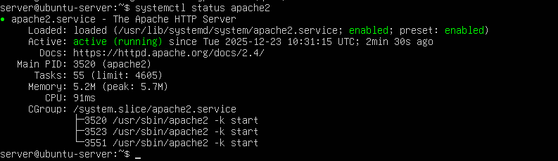
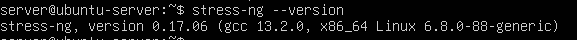

## PHASE 3: APPLICATION SELECTION FOR PERFORMANCE TESTING (WEEK-3)

## 1. Overview:
The focus of Week 3 was to select suitable applications for evaluating different types of system workloads. Instead of using random software, each application was deliberately chosen to stress a specific component of the operating system, including CPU, memory, disk I/O, network activity, and long-running server processes.

These applications will be used in later phases to observe how the Linux server behaves under load, identify performance bottlenecks, and analyse the effects of system optimisation and security controls.

## 2.Application Selection Strategy:
To ensure a balanced and realistic performance evaluation, each selected application represents a different workload category:

1. CPU-intensive workloads

2. Memory-intensive workloads

3. Disk I/O–intensive workloads

4. Network-intensive workloads

5. Long-running server-style workloads

This approach reflects real-world server usage, where multiple system resources are often stressed simultaneously rather than in isolation.


## 3.Application Selection Matrix:
|Application	       |Workload Type     |Reason for selection                                       |
|--------------------|------------------|-----------------------------------------------------------|
|`stress-ng`           |CPU and Memory 	  |Commonly used stress testing tool with fine-grained control|
|`stress-ng` (I/O mode)|Disk I/O	        |Generates disk read/write activity for storage testing     |
|`iperf3`	             |Network throughput|Standard tool for measuring network bandwidth              |
|`Ping`	               |Network latency	  |Simple way to measure latency and packet loss              |
|`Apache2`	           |Server workload	  |Represents a real-world web server service                 |
 
These tools are lightweight, well-documented and widely used in Linux environments.


## 4. Installation Documentation (via SSH)
All required applications were installed remotely on the server VM using SSH from the workstation, in line with the coursework requirements.

```bash
sudo apt update
sudo apt install stress-ng iperf3 apache2 -y
```
 

Installation of performance testing applications (stress-ng, iperf3, and Apache) on the server via SSH.
After installation, the Apache web server runs automatically as a systemd-managed service.
```bash
systemctl status apache2
```



Apache web server running as an active systemd service following installation.

To verify successful installation, application versions were checked:

```bash
stress-ng --version
 ```


```bash
apache2 -v
 ```


These confirmations ensure that all selected applications are correctly installed and ready for performance testing in later phases.

## 5. Expected Resource Profiles
Before running any tests, the expected behaviour of each application was documented to allow comparison with real results later.

**`stress-ng` (CPU workload)**

•	High CPU usage across available cores

•	Minimal disk activity

•	Moderate memory usage

**`stress-ng` (Memory workload)**

•	Rapid increase in RAM usage

•	Increased memory pressure

•	Useful for identifying memory limits

**`stress-ng` (Disk I/O workload)**

•	Increased disk read/write operations

•	Higher I/O wait times

•	Useful for testing filesystem performance

**`iperf3`**

•	High network throughput 

•	Increased network interrupt activity 

•	Minimal CPU and disk impact

**`apache2`**

•	Low resource usage when idle

•	Increased CPU and memory usage under load

•	Represents a realistic long- running server process

These expectations will be compared with actual measurements in later weeks.


## 6. Monitoring Strategy:
All monitoring will be performed remotely over SSH form the workstation during testing.

|Tool	    |Purpose                               |
|---------|--------------------------------------|
|`top/htop`	|Monitor CPU and memory usage          |
|`vmstat`  	|View CPU, memory, and system activity |
|`ioptop`	  |Monitor disk read/write activity      |
|`ss -tuln`	|View active network connections       |
|`iftop`	  |Observe system logs during load       |

Each workload will be tested individually to avoid overlapping results and ensure clear, interpretable data.

## 7. Example Test Commands (Planned)
The following commands demonstrate how the workloads will be generated in later phases:
**•	CPU stress:**
```bash
stress-ng --cpu 2 --timeout 60s
```

**•	Memory stress**
```bash
stress-ng --vm 1 --vm-bytes 1G --timeout 60s
```
**•	Disk I/O stress**
```bash
stress-ng --hdd 1 --timeout 60s
```
**Network throughput (iperf3)**

**•	On server:**
```bash
iperf3 -s
```
**•	On workstation:**
```bash
iperf3 -c 192.168.56.102
```
## 8. Reflection
Week 3 focused on planning rather than executing performance tests. Selecting appropriate applications clarified how different system resources can become bottlenecks under load. Documenting expected behaviour before testing reinforced the importance of structured performance evaluation instead of ad-hoc experimentation.

This preparation will support accurate analysis and informed optimisation decisions in later phases of the coursework.

## 9. REFERENCES:
[1] Canonical Ltd., “stress-ng Manual Page,” Ubuntu Documentation, 2024. [Online]. Available: https://manpages.ubuntu.com/manpages/noble/en/man1/stress-ng.1.html. [Accessed: 14-Dec-2025].

[2] ESnet, “iperf3 – A TCP, UDP, and SCTP Network Bandwidth Measurement Tool,” 2024. [Online]. Available: https://iperf.fr/iperf-doc.php. [Accessed: 14-Dec-2025].

[3] Apache Software Foundation, “Apache HTTP Server Documentation,” 2024. [Online]. Available: https://httpd.apache.org/docs/. [Accessed: 14-Dec-2025].

[4] Linux Foundation, “Linux Performance Monitoring Tools,” 2023. [Online]. Available: https://www.kernel.org/doc/html/latest/admin-guide/perf.html. [Accessed: 14-Dec-2025].


⬅️ [Previous: Week 2](../Week2/Week2.md)  ⏭️ [Next: Week 4](../Week4/Week4.md)


