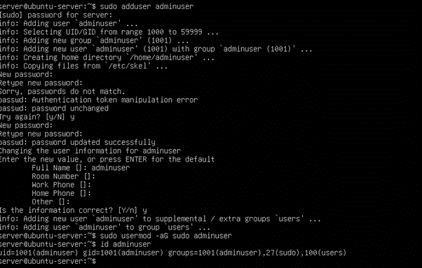
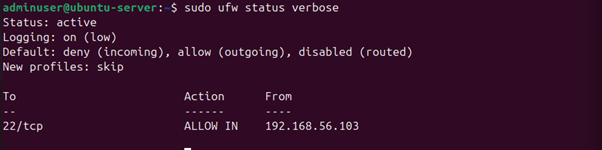
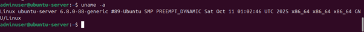

# Phase 4: Initial System Configuration & Security Implementation (Week 4)

## Overview

The focus of Week 4 was to deploy the server securely and implement foundational security controls. All configuration tasks were performed remotely via SSH from the workstation, in accordance with the coursework administrative constraints. The objective was to establish secure remote access, enforce least-privilege administration, and restrict network exposure before implementing advanced security controls in later phases.

---

## 1. Creation of a Non-Root Administrative User

To apply the principle of least privilege, a dedicated non-root administrative user was created for server management. This ensures that routine administrative tasks are not performed as the root user, reducing the impact of potential security compromises.
```bash
sudo adduser adminuser
sudo usermod -aG sudo adminuser
id adminuser
 ```


The output confirmed that the user was successfully added to the sudo group, allowing administrative privileges when required.

---

## 2. Verification of Administrative Access via SSH
Before applying further security restrictions, it was essential to confirm that the new administrative user could log in remotely and perform privileged actions.
From the workstation, SSH access was tested using the new account:
```bash
ssh adminuser@192.168.56.102
sudo whoami
```
The output confirmed successful SSH authentication and correct privilege escalation using sudo, verifying that the administrative user was configured correctly.

 


## 3. SSH Key-Based Authentication
To eliminate password-based authentication and improve security, SSH key-based authentication was configured.

SSH keys were generated on the workstation and securely copied to the server. After deployment, Passwordless login was tested to confirm correct configuration:
```bash
ssh adminuser@192.168.56.102
```
The server accepted the SSH key without prompting for a password, confirming successful key-based authentication.


## 4. SSH Hardening
After confirming key-based access, the SSH service was hardened to reduce the attack surface.

**Before hardening**

•	Root login was permitted

•	Password authentication was enabled

**After hardening**

•	Root SSH login disabled

•	Password-based authentication disabled

•	Public key authentication enforced

The SSH configuration file was modified as follows:
```bash
sudo nano /etc/ssh/sshd_config
```
Key configuration values:

PermitRootLogin no
PasswordAuthentication no
PubkeyAuthentication yes

Configuration files were reviewed before and after modification to verify that SSH hardening was applied correctly.

The SSH service was then restarted:
```bash
sudo systemctl restart ssh
```

 

SSH configuration hardened by disabling root login and password authentication.


Successful SSH access using key-based authentication confirmed that hardening was applied correctly without causing lockout.

## 5. Firewall Configuration (UFW)
A host-based firewall was configured to strictly control inbound traffic. The firewall policy was designed to allow SSH access only from the trusted workstation IP over the Host-Only network.
```bash
sudo ufw reset
sudo ufw default deny incoming
sudo ufw default allow outgoing
sudo ufw allow from 192.168.56.103 to any port 22 proto tcp
sudo ufw enable
sudo ufw status verbose
```
This configuration ensures that:

•	All unsolicited inbound connections are blocked

•	SSH access is restricted to a single trusted source

•	Outbound traffic remains unrestricted for updates and monitoring
 



Firewall configured to restrict SSH access to the trusted workstation only.

## 6. Remote Administration Evidence
To demonstrate compliant remote administration, system commands were executed on the server exclusively via SSH from the workstation.
```bash
uname -a
```
This confirms that all administration was performed remotely and securely via SSH.




This confirms that all administration was performed remotely and securely via SSH.

## Reflection

Week 4 highlighted the importance of correct sequencing in security configuration. SSH key authentication had to be verified before disabling password access to prevent accidental lockout. An initial permission-related issue with SSH keys reinforced the importance of correct file ownership and permission settings in Linux security.

This phase demonstrated how multiple security controls: user privilege separation, authentication hardening, and firewall enforcement combine to form a secure baseline. Successfully resolving configuration issues improved my confidence in troubleshooting Linux server environments and reinforced professional system administration best practices.


## References

[1] Canonical Ltd., “OpenSSH Server Configuration,” Ubuntu Documentation, 2024.
Available: https://ubuntu.com/server/docs/service-openssh
[Accessed: 25-Dec-2025].

[2] Canonical Ltd., “UFW Firewall,” Ubuntu Documentation, 2024.
Available: https://documentation.ubuntu.com/server/how-to/security/firewalls/
[Accessed: 25-Dec-2025].

[3] OpenSSH Project, “OpenSSH Manual Pages,” 2024.
Available: https://man.openbsd.org/sshd_config
[Accessed: 25-Dec-2025].


⬅️ [Previous: Week 3](../Week3/Week3.md)  ⏭️ [Next: Week 5](../Week5/Week5.md)
