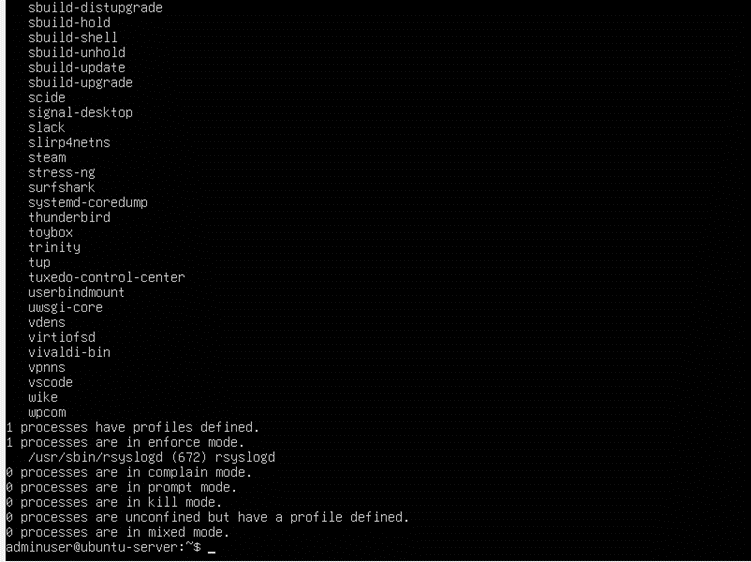
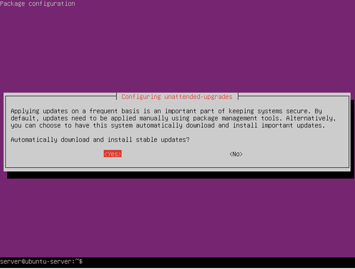
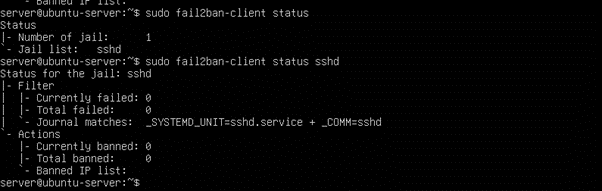

# Phase 5: Advanced Security and Monitoring Infrastructure (Week 5)

## Overview

Week 5 focused on extending the foundational security controls implemented in Week 4 by introducing advanced protection, intrusion detection, and automated monitoring. The objective was to enhance the server’s ability to prevent, detect, and verify security incidents while enabling continuous remote performance monitoring. All configurations were performed remotely via SSH from the workstation.

---

## 1. Mandatory Access Control (AppArmor)

To strengthen system security beyond traditional discretionary access control, AppArmor was used to enforce mandatory access control (MAC) policies. AppArmor restricts what applications can access, even if a service is compromised, thereby limiting the potential impact of an attack.

AppArmor was already installed by default on Ubuntu Server. Its status was verified using:
```bash
sudo aa-status
```
The output confirmed that AppArmor was active and enforcing security profiles for system services, demonstrating that mandatory access control was enabled.



## 2. Automatic Security Updates
To reduce exposure to known vulnerabilities, automatic security updates were enabled using Ubuntu’s unattended-upgrades mechanism. This ensures that critical security patches are applied automatically without requiring manual intervention.

Unattended upgrades were configured using:
```bash
sudo dpkg-reconfigure unattended-upgrades
```
Verification was performed by inspecting systemd timers responsible for automated updates:
```bash
systemctl list-timers | grep apt
```

The presence of active `apt-daily` and `apt-daily-upgrade` timers confirmed that automatic security updates were enabled.




Figure: Active systemd timers confirming automated security updates are scheduled and running.


## 3. Intrusion Detection – fail2ban
fail2ban was deployed to protect the server against brute-force attacks by monitoring authentication logs and automatically banning IP addresses after repeated failed login attempts.

Installation and service activation were performed using:
```bash
sudo apt install fail2ban -y
sudo systemctl enable fail2ban
sudo systemctl start fail2ban
```
A local configuration file was used to enable SSH protection without modifying default configuration files. The SSH jail status was verified using:
```bash
sudo fail2ban-client status sshd
```
The output confirmed that the SSH jail was active and monitoring authentication logs.



## 4. Security Baseline Verification Script
To ensure that all security controls could be verified consistently, a server-side security baseline verification script (security-baseline.sh) was developed. This script automates validation of the core security configurations implemented in Weeks 4 and 5.

The script checks:

•	SSH hardening (root and password login disabled)

•	Firewall status

•	AppArmor enforcement

•	Automatic security update timers

•	fail2ban SSH protection

The script was executed on the server using a non-root administrative user:
```bash
./security-baseline.sh
```


**Important note:**

Some security checks (such as UFW status, AppArmor profile access, and fail2ban socket access) require root privileges. When executed as a non-root user, the script correctly reports permission restrictions. This behaviour demonstrates effective privilege separation and confirms that sensitive security components are protected from unprivileged access.

## 5. Remote Monitoring Script
To support performance evaluation in later phases, a remote monitoring script (monitor-server.sh) was developed on the workstation. The script connects to the server via SSH and collects live performance metrics without installing monitoring agents on the server.

Metrics collected include:
•	System uptime

•	CPU load

•	Memory usage

•	Disk utilisation

The script was executed from the workstation using:
```bash
./monitor-server.sh
```
 


## Reflection

Week 5 demonstrated the importance of layered security controls and automation in Linux server administration. Implementing AppArmor, fail2ban, and automatic updates reinforced how prevention, detection, and response mechanisms work together to reduce attack surfaces. Developing verification and monitoring scripts highlighted the value of automation in maintaining security consistency and detecting configuration drift. This phase prepared the system for controlled performance evaluation in subsequent phases.

## References

[1] Canonical Ltd., “AppArmor Documentation,” Ubuntu Security Documentation, 2024.
Available: https://documentation.ubuntu.com/security/security-features/privilege-restriction/apparmor/
[Accessed: 25-Dec-2025].

[2] Canonical Ltd., “Unattended Upgrades,” Ubuntu Server Documentation, 2024.
Available: https://ubuntu.com/server/docs/package-management
[Accessed: 25-Dec-2025].

[3] Fail2ban Project, “Fail2ban Documentation,” 2024.
Available: https://www.fail2ban.org/wiki/index.php/Main_Page
[Accessed: 25-Dec-2025].

[4] Linux Foundation, “System Administration and Monitoring,” 2023.
Available: https://www.kernel.org/doc/
[Accessed: 25-Dec-2025].

⬅️ [Previous: Week 4](../Week4/Week4.md)  ⏭️ [Next: Week 6](../Week6/Week6.md)
