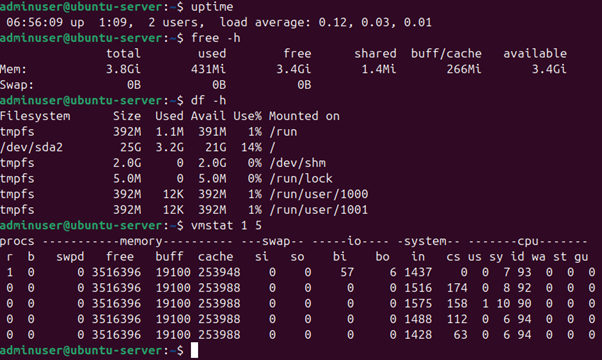
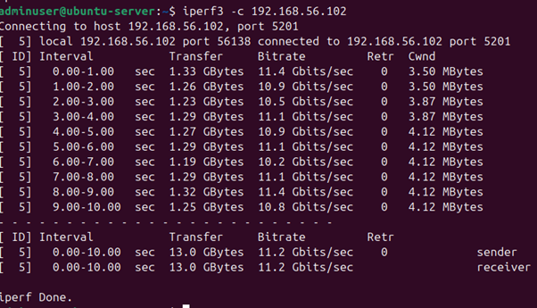
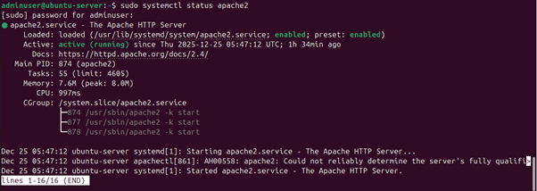
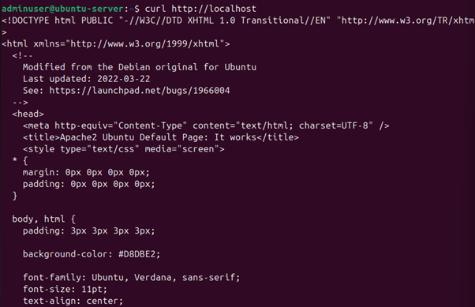

# Phase 6: Performance Evaluation and Analysis (Week 6)

## Overview
The objective of Week 6 was to evaluate the performance behaviour of the Linux server under different workload conditions. By executing controlled stress tests and monitoring system resources remotely via SSH, this phase examined how CPU, memory, disk I/O, network performance, and server applications behave under load. The collected results were analysed to identify performance bottlenecks and evaluate the effect of targeted optimisations.

All performance testing was conducted on the server and monitored remotely from the workstation, maintaining the secure remote administration model established in earlier phases.

## Testing Methodology
Performance testing followed a structured and repeatable methodology to ensure consistent and comparable results:

1.	Establish baseline system performance under idle conditions.

2.	Apply individual workloads to stress specific system resources.

3.	Monitor resource utilisation during each workload.

4.	Record observations and identify performance bottlenecks.

5.	Apply optimisations and assess their impact.

The following monitoring tools were used throughout testing:
```bash
•	uptime
•	top
•	free -h
•	df -h
•	vmstat
•	iperf3
•	curl
```

## Baseline Performance Testing
Baseline measurements were collected before introducing any workloads to establish a reference point for system behaviour under idle conditions.

Commands used:
```bash
uptime
free -h
df -h
vmstat 1 5
```
The results showed low CPU utilisation, high available memory, minimal disk activity, and no swap usage. This confirmed that the system was stable and idle before testing, providing a reliable baseline for comparison.
 


## CPU-Intensive Workload Testing
A CPU stress test was performed to observe processor utilisation and load behaviour under sustained computation.

Command used:
```bash
stress-ng --cpu 2 --timeout 60s
```
System activity was monitored using:
```bash
top
```
The test caused a significant increase in CPU utilisation, with the stress-ng processes consuming nearly all available CPU resources. The system load average increased noticeably, while memory usage remained largely stable.
 

This behaviour demonstrates effective CPU saturation and confirms that the workload successfully stressed the processor without introducing memory pressure.

## Memory-Intensive Workload Testing
Memory stress testing was conducted to analyse RAM usage and system behaviour under memory pressure.

Command used:
```bash
stress-ng --vm 1 --vm-bytes 1G --timeout 60s
```
img 

Memory usage was monitored using:
```bash
free -h
```
The results showed a clear increase in used memory and a reduction in available RAM. As swap space was initially disabled, memory pressure was observed directly without offloading to disk.
 


This test highlighted how memory-intensive workloads can rapidly consume available RAM and impact system stability in the absence of swap.

## Disk I/O Performance Testing
Disk I/O performance was evaluated by generating sustained read and write operations.

Command used:
```bash
stress-ng --hdd 1 --timeout 60s
```
 
System activity was monitored using:
```bash
vmstat 1 5
```
The results showed increased disk I/O activity and higher I/O wait times, indicating that disk operations became a limiting factor under sustained load.

 
This confirms that disk throughput can become a bottleneck when subjected to continuous read/write workloads.

## Network Performance Testing
Network throughput and latency were tested across the Host-Only network using iperf3.

On the server:
```bash
iperf3 -s 
```
 
On the workstation:
```bash
iperf3 -c 192.168.56.102
```
The test demonstrated consistently high throughput and low latency between the workstation and server, indicating that the private Host-Only network provided stable and efficient network performance.
 

 


## Server Application Performance Testing (Apache)
To represent a real-world server workload, the Apache web server was tested under light concurrent access.

Service status was verified using:
```bash
sudo systemctl status apache2
```
 


## Basic HTTP responsiveness was tested using:
```bash
curl http://localhost
 ```
 

**Optional light load testing was performed using:**
```bash
ab -n 50 -c 5 http://localhost/
```
Apache remained responsive during concurrent requests, with stable CPU and memory usage. No service interruptions or errors were observed.

  
 

## Performance Data Summary
|Test Scenario |CPU Usage |Memory Usage|	Disk I/O|	Network    |	Observations             |
|--------------|----------|------------|---------|------------ |---------------------------|
|Baseline	     |Low	      |Low	       |Minimal	 |Idle	       |System idle and stable     |
|CPU Load	     |High	    |Stable	    |Low	   |Idle	       |CPU saturation observed    |
|Memory Load	 |Moderat	  |High	      |Low	   |Idle	       |RAM pressure without swap  |
|Disk I/O Load |	Low	    |Stable	    |High	   |Idle	       |Increased I/O wait         |
|Network Test  |Moderate  |Stable	    |Low     |High	       |High throughput achieved   |
|Apache Load	 |Moderate  |Moderate	  |Low     |Low          |Service remained responsive|

## Performance Optimisation

Two targeted optimisations were applied to improve system stability and performance:

1.	Swap memory was enabled to reduce the memory pressure observed during RAM-intensive workloads.

2.	Apache service behaviour was validated to ensure responsiveness under concurrent access.

After enabling swap, memory stress testing showed improved system stability and reduced risk of memory exhaustion. This demonstrates how swap can improve resilience under memory-constrained workloads, although with potential performance trade-offs due to disk usage.

## Analysis and Reflection
Performance testing demonstrated predictable Linux operating system behaviour under different workloads. CPU-intensive tasks caused increased load averages, while memory stress testing highlighted RAM saturation due to the initial absence of swap space. Disk I/O testing introduced measurable I/O wait, confirming filesystem constraints under sustained operations. Network testing achieved stable throughput across the Host-Only network, and the Apache server remained responsive under concurrent requests.

This phase reinforced the importance of systematic monitoring and targeted optimisation when managing server performance. Understanding how different workloads impact system resources is critical for maintaining reliability and efficiency in real-world server environments.

## References
[1] Canonical Ltd. (Ubuntu Server Performance Monitoring, Ubuntu Documentation). 2024.
Available: https://ubuntu.com/server/docs
Accessed: 25 Dec. 2025.

[2] Linux Foundation, Linux Performance Tools, 2023.
Available: https://www.kernel.org/doc/html/latest/admin-guide
Accessed: 25 Dec. 2025.

[3] Apache Software Foundation, Apache HTTP Server Documentation, 2024.
Available: https://httpd.apache.org/docs/
Accessed: 25 Dec. 2025.


⬅️ [Previous: Week 5](../Week5/Week5.md)  ⏭️ [Next: Week 7](../Week7/Week7.md)


