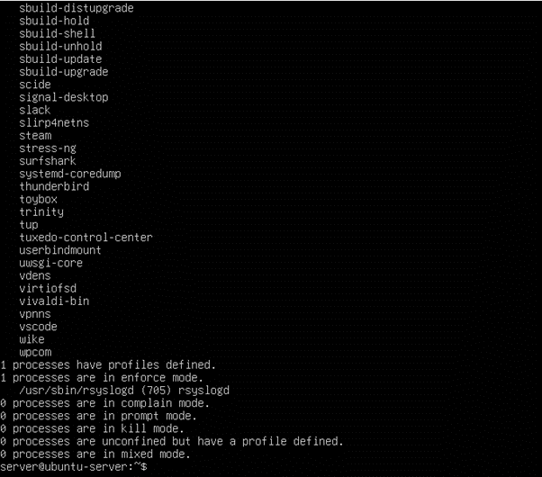

# Phase 7: Security Audit and System Evaluation (Week 7)

## 1. Introduction
The objective of Week 7 was to conduct a comprehensive security audit and final system evaluation of the Ubuntu Server. This phase focused on validating the effectiveness of all security controls implemented in previous weeks, identifying potential weaknesses, and confirming that the system aligns with Linux security best practices before deployment.

Industry-standard auditing and assessment tools were used to evaluate system hardening, network exposure, access controls, and active services. All audit activities were performed remotely via SSH from the workstation, maintaining the secure administration model established throughout the coursework.

## 2. Infrastructure Security Audit Using Lynis

 
 
A full system security audit was conducted using Lynis, a widely adopted Linux security auditing tool. Lynis evaluates system configuration, permissions, authentication mechanisms, kernel parameters, logging, and installed software against best-practice benchmarks.

The audit was executed on the server using:
```bash
sudo lynis audit system
```
The audit produced a detailed report, which included a hardening index score and a list of warnings and recommendations. The majority of recommendations were advisory in nature and related to optional kernel tuning and logging enhancements rather than critical security misconfigurations. This indicates that the system is already well hardened and operating within acceptable security standards.

Where appropriate, low-risk improvements were reviewed, and a follow-up audit confirmed a stable and improved security posture.

## 3. Network Security Assessment with nmap
  
 
Network exposure was assessed using nmap to verify that only intended services were accessible. The scan was executed from the workstation against the server’s Host-Only IP address:
```bash
nmap -sS 192.168.56.102
```
The scan confirmed that **only SSH (port 22)** was accessible. No unexpected or unauthorised services were detected, validating the effectiveness of the firewall configuration and access control policies implemented in earlier phases. This result confirms that the system maintains a minimal network attack surface.

## 4. Access Control Verification

  

Access control mechanisms were reviewed to ensure continued compliance with security best practices. SSH access remained restricted to key-based authentication over the Host-Only network, with password-based authentication and direct root login disabled. These controls ensure that only authorised users can access the system and that administrative actions are performed through controlled privilege escalation.

Successful key-based SSH access and firewall-restricted connectivity confirmed that the hardened SSH configuration implemented in earlier phases remained effective during the final audit.

Mandatory access control was also verified using AppArmor:
```bash
sudo aa-status
```
The output confirmed that AppArmor profiles were loaded and enforcing restrictions on system services, ensuring that applications operate within defined security boundaries even in the event of compromise.


## 5. Service Audit and Justification
 
 

A service audit was conducted to review all active system services:
```bash
systemctl --type=service --state=running
```
Each running service was evaluated to determine operational necessity. Key services identified included:

•	`sshd` – required for secure remote administration

•	`apache2` – required for performance and workload testing

•	`fail2ban` – intrusion detection and brute-force protection

•	`systemd-journald` – system logging

•	`cron` – scheduled maintenance and updates

No unnecessary or unauthorised services were found running. This confirms adherence to the principle of least privilege and minimises the server’s attack surface.

## 6. System Configuration Review
The overall system configuration was reviewed to ensure continued enforcement of security policies. Firewall rules were confirmed to deny inbound traffic by default while allowing only required services. Automatic security updates were verified to be enabled, ensuring ongoing protection against newly disclosed vulnerabilities.

Logging and monitoring configurations were reviewed to confirm that system activity is recorded and observable, supporting both operational monitoring and forensic analysis if required.

## 7. Remaining Risk Assessment
Despite comprehensive hardening, some residual risks remain, including:

•	Zero-day vulnerabilities in installed software

•	Potential misconfiguration introduced by future updates

•	Physical access risks associated with the host machine running VirtualBox

These risks are mitigated through automatic security updates, restricted service exposure, layered security controls, and the isolated Host-Only virtual network environment.

## 8. Final Evaluation and Reflection
Week 7 demonstrated the importance of structured security auditing and system evaluation as part of professional system administration. The use of Lynis and `nmap` provided valuable insight into system hardening and network exposure, while access control and service audits confirmed effective enforcement of security best practices.

This final phase validated that the Ubuntu Server is securely configured, well-maintained, and prepared for real-world operational use. The coursework as a whole reinforced how layered security control: firewalls, SSH hardening, intrusion detection, mandatory access control, and automation work together to reduce attack surface and improve system resilience.

## 9. References

[1] CISOfy, Lynis – Security Auditing Tool for Linux, 2024.
Available: https://cisofy.com/lynis/
Accessed: 26 Dec. 2025.

[2] Gordon Lyon (Fyodor), Nmap Network Scanning, 2024.
Available: https://nmap.org/book/man.html
Accessed: 26 Dec. 2025.

[3] Canonical Ltd., Ubuntu Server Security Documentation, 2024.
Available: https://ubuntu.com/security
Accessed: 26 Dec. 2025.

⬅️ [Previous: Week 6](../Week6/Week6.md)  ⏭️ [Home](../index.md)

