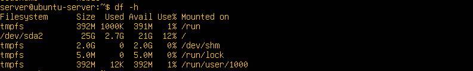
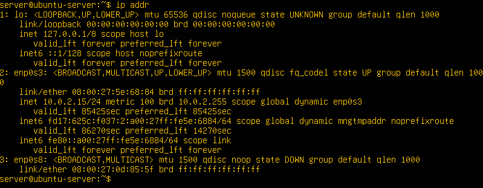

# Phase 1: System Planning and Distribution Selection (Week 1)

  This week, I will focus on building a reliable virtualised environment for the rest of the coursework. I have set up two virtual machines inside Oracle VirtualBox on my Windows host system:  

•	Workstation VM: Ubuntu Desktop 24.04

•	Server VM: Ubuntu Server 24.04

Both VMS are connected using a dual-adapter configuration:

•	Adapter 1- NAT: provide internet access for installation and updates.

•	Adapter 2- Host-Only Network: provides a private, isolated internal network that exist only between the workstation to the server.

## Part A - System Architecture Diagram:

This dual-adapter design ensures the server is reachable only from
the workstation, replicating a secure administration model used in real data centres.

## Part B - Distribution Selection Justification:
Linux Distribution Family Comparison:
|Family         |Example | Strengths |   weakness| Reason Not Selected |
|---------------|--------|-----------|-----------|---------------------|
|Debian Family  |Debian , Ubuntu|Very Stable,widely Supported |Debian packages are often outdated |Ubuntu offer stability +fresher packages|
|Red Hat Family |	RHEL, CentOS stream|	Enterprise-grade tools	|CentOS Stream changes too frequently |Overkill for small VM environment|
|Arch Family	|Arch Linux, Manjiro 	|Very flexible and up-to-date 	|Requires a lot of manual setup |Not Ideal for a server workload|
|SUSE Family	|OpenSUSE, SLES|	Powerful admin tools 	|More complex for beginners |Minimal learning resources|

WHY I CHOSE UBUNTU SERVER 24.04.LTS:

I picked Ubuntu for several reasons:

•	LTS reliability: It provides long-term support with five years of security updates.

•	Strong documentation: Reliable for commands, services and hardening procedures

•	Included AppArmor by default: required access control for later in my project.

•	Simple and dependable networking: For a headless environment, Netplan with system-networkd is perfect.

•	Industry relevance: Due to Ubuntu’s dominance of cloud platforms (AWS, Azure and GCP), this setup is professionally valuable. 

 Lastly, considering all the above reasons, Ubuntu server provides simple, secure and up-to-date features.

## PART C: Workstation Configuration decision:
 
  I have chosen Ubuntu Desktop as my workstation environment compared to a Windows host or a hybrid setup. Reason:

 WHY UBUNTU DESKTOP IS THE BEST CHOICE?

•	Native Linux tooling:  It included SSH, client, package managers, monitoring tools, and scripting support by default.

•	Consistency: Using Linux on both virtual machines (VMs) minimises command mismatches and makes troubleshooting easier.

•	Safe separation: To avoid accidental configuration on the wrong system, the workstation (VMs) isolates all administrative activity from the Windows host.

•	Ideal for scripting week: Bash scripts behave consistently on both the  workstation and server.

Why not choose a Windows host directly?

•	For SSH, Windows uses PowerShell PuTTY, which makes later scripting and automation tasks more difficult.

•	The industry standard, particularly for server environments, is Linux-to-Linux administration. 

## Part D: Network Configuration Documentation:
  In this section, I will explain how both VMs are connected inside VirtualBox using NAT and Host-Only networking, providing screenshots to illustrate the process.

D.1 VirtualBox Network Adapters – Workstation VM

Adapter 1 — NAT (Internet Access)

The first adapter is set to NAT, which provides internet access through the host machine to download, security updates, and package installation.

Adapter 2 — Host-Only Network (Private SSH Network)

The second network adapter is set to Host-Only, which connects the workstation directly to the server VM inside and isolates the VirtualBox subnet.

D.2 VirtualBox Network Adapters – Server VM

Adapter 1: NAT
The first network adapter is a NAT similar to that in a workstation, and it is for external package updates.

Adapter 2: Host-Only
The second network adapter is set to Host-Only, for private SSH access for the workstation. This ensures the server is isolated and cannot be accessed from outside the host-only network.

D.3 Host-Only Network Configuration(vboxnet0):

Adapter Settings:

This shows the Host-Only network adapter(vboxnet0), IPv4 address 192.168.56.1 and IPv4 Network Mask 255.255.255.0.
This address ensures that all VMs are connected to the Host-Only network.

DHCP Server settings:

•	The DHCP Server for vboxnet0 is enabled and addresses between 192.168.56.101 -192.168.56.254.

•	My server VM (192.168.56.102) and workstation VM (192.168.56.103) both use Ips inside this range.

•	This ensures reliable, private, isolated communication via SSH for testing.

## Part E: System Specifications:

  As required by the coursework, I used the baseline to gather hardware and OD data to record the baseline configuration of the Ubuntu Server VM using the required CLI tools.

1.	Memory Information

 Command: free -h

 Purpose: Analyse memory and swap usages and print the result in human-readable units (Mib/    Gib). 
  	
  

 Summary:

  Here, the VM has a total of 3.8 GB of RAM and mostly is free since no heavy processes         have been run yet. Swap is not set up. This confirms that the server has enough capacity      for further performance workload and monitoring 

2. Disk Usage

Command:  df -h

Purpose: It displays disk layout and free space in a human-readable format 

 The result shows the root filesystem (/dev/sda2) is 25GB total with only 12% being used. This confirms that I have plenty of space for the future and is cleanly configured.

3. Distribution Information

Command: lsb_release -a
 
Purpose: It confirmed the operating system version 

Summary: The server is running Ubuntu Server 24.04.3 LTS (noble)

4.	Kernel and System Information

Command: uname -a
   
Purpose: Display kernel version and system architecture

Summary: Kernel version: 6.8.0-40-generic on x86_64 architecture 

5. Network Interfaces

Command: ip addr

Purpose: Display all network interfaces and assigned IP addresses. Used to validate Correct VirtualBox networking(NAT + Host-Only).

Server VM Output:     

Result:

•	enp0s3 (NAT): 10.0.2.15

•	enpos8(Host-Only): 193.164.56.102

Workstation VM Output:

Result:

•	enp0s3 (NAT): DHCP via VirtualBox

•	enp0s8 (Host-Only): 192.168.56.103

Why these matters

 These results confirm that an isolated Host-Only network has successfully connected both virtual machines. This setup ensures that all administration server is run remotely via SSH, meet the necessary architectural and security requirements.

## WEEK 1: REFLECTION:
 This week was all about the foundation for the entire coursework journey by setting up both machines and configuring the network correctly. The main challenge was setting up the virtual networking environment correctly. After running all the code, I then realised my workstation virtual machine is missing the interface(enp0s8), and a conflicting netplan configuration was caused due to VirtualBox failing to assign the Host-Only interface. This problem was fixed by rebuilding the workstation virtual machine and readjusting the Host-Only network.
Even though this part with annoying, it gave me a clear understanding of how Linux networking depends on both OS-level configuration and hypervisor settings. Additionally, I also gained some experience with Netplan, network adapters, DHCP, and interface naming, which are crucial for performance testing, monitoring scripts, and SSH hardening in the future.
Overall, considering all the things week 1 gave me a strong technical foundation and understand how a virtualised network environment works in a real system.

## References :

[1] Canonical Ltd., "Ubuntu Server 24.04 LTS Documentation," 2024.
    Available: https://ubuntu.com/server/docs. Accessed: 15 Dec 2025
    
[2] Oracle Corporation, "VirtualBox User Manual - Chapter 6: Virtual Networking," 2024.
    Available: https://www.virtualbox.org/manual/ch06.html. Accessed: 15 Dec 2025.

[3] Canonical Ltd.,  "Ubuntu Desktop 24.04 LTS Documentation," 2024.
    Available: https://ubuntu.com/desktop. Accessed: 15 Dec 2025.

[4] Linux Foundation, "Linux Manual Pages: uname(1), free(1), df(1), ip(8)," 2024.
    Available: https://man7.org/linux/man-pages/. Accessed:15 Dec 2025.

[5] Canonical Ltd., "Netplan- Official Configuration Reference," 2024.
    Available: https://netplan.io/reference. Accessed: 15 Dec 2025.

[6] Oracle Corporation, "VirtualBox Host-Only Networking Explained," 2024.
    Available: https://www.virtualbox.org/manual/ch06.html#network_hostonly. Accessed: 15 Dec 2025.
      
 [ Back to Home](../index.md)  

